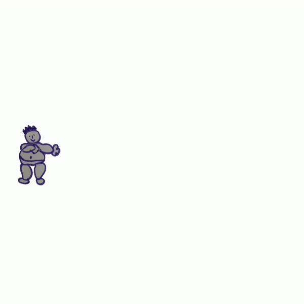
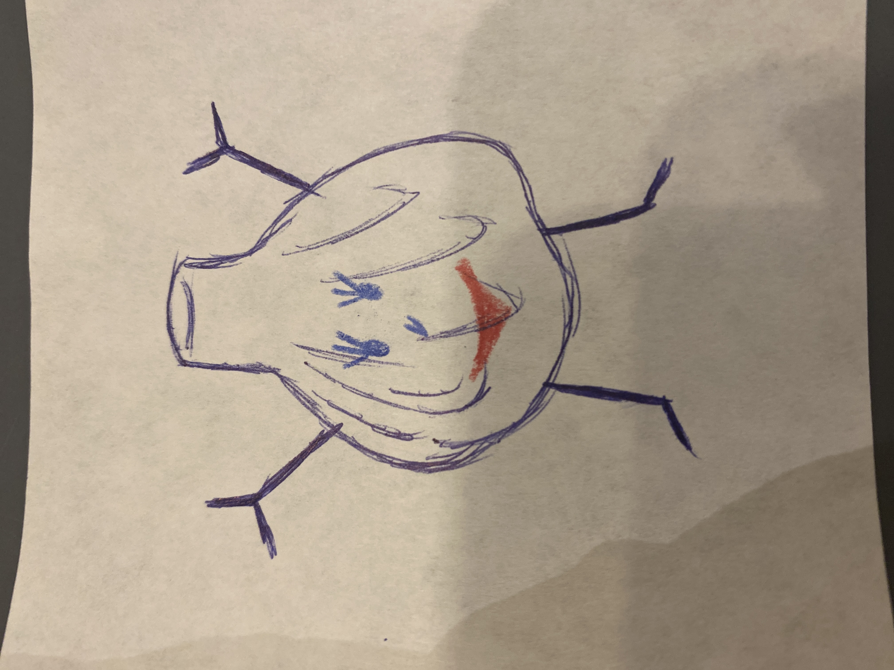
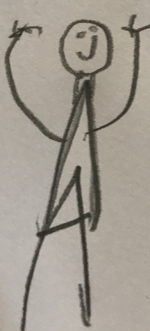

# Animated Drawings
This repo contains an implementation of the algorithm described within the paper, `A Method for Automatically Animating Children's Drawings of the Human Figure.' In addition, this repo aims to be a useful creative tool in it's own right, allowing you to flexibly create animations starring your own drawn characters.

## Installation

We *strongly* recommend activating a Python virtual environment prior to installing Animated Drawings. 
Conda's Miniconda is a great choice. Follow [these steps](https://conda.io/projects/conda/en/stable/user-guide/install/index.html) to download and install it. Then run the following commands:

    # create and activate the virtual environment
    conda create --name animated_drawings python=3.8.13
    conda activate animated_drawings

    # clone AnimatedDrawings and use pip to install
    git clone git@github.com:fairinternal/AnimatedDrawings.git
    cd AnimatedDrawings
    pip install -e .

If you get a `permission denied` erorr when trying to clone the repo, you don't have access. 
To get permission, follow the instructions on [this page](https://www.internalfb.com/intern/wiki/FAIR/Platforms/Getting_started/fairinternal-github/).

## Using Animated Drawings

### Interactive Window
We provide some example top-level configuration files (or 'mvc_configs') to demonstrate how to run the rendering code.
Scenes are created and rendered according to the parameters within the mvc_config.
To see for yourself, make sure the `animated_drawings` virtual environment is activated, then launch a Python interpreter from within the AnimatedDrawings root directory and run the following commands:

    from animated_drawings import render

    render.start('./examples/config/mvc/interactive_window_example.yaml')

If everything is installed correctly, an interactive window should appear on your screen. 
(Use space to pause/unpause the scene, arrow keys to move back and forth in time, and q to close the screen.)

    

### Export MP4 video

Suppose you'd like to save the animation as a video file instead of viewing it directly in a window. Specify a different example mvc_config:

    from animated_drawings import render

    render.start('./examples/config/mvc/export_mp4_example.yaml')

You should see a file, video.mp4, located in the same directory as your script.

    

### Export transparent .gif

Perhaps you'd like a transparent .gif instead of an .mp4? Use this:

    from animated_drawings import render

    render.start('./examples/config/mvc/export_gif_example.yaml')

You'll find video.gif residing within the same directory as your script.

    

### Headless Rendering

If you'd like to generate a video headlessly (e.g. on a remote server accessed via ssh), you'll need to specify `USE_MESA: True` within the `view` section of the mvc_config file.

    view:
      USE_MESA: True

### Creating an animation from an image

All of the above examples use drawings with pre-existing annotations.
But suppose you'd like to create an animation starring your own drawing? 
To enable that functionality, you'll need to [install Docker](https://docs.docker.com/get-docker/) and follow [these steps](torchserve/torchserve/model-store/README.md) to download the necessary model weights.

Run the following commands, starting from the Animated Drawings root directory:

    cd torchserve

    # build the docker image... this takes a while (~5-7 minutes on Macbook Pro 2021)
    docker build -t docker_torchserve .

    # start the docker container and expose the necessary ports
    docker run -d --name docker_torchserve -p 8080:8080 -p 8081:8081 -v $(pwd)/torchserve:/home/torchserve docker_torchserve

Wait ~10 seconds, then ensure Docker and TorchServe are working by pinging the server:

    curl http://localhost:8080/ping

    # should return:
    # {
    #   "status": "Healthy"
    # }

If, after waiting, the response is `curl: (52) Empty reply from server`, one of two things is likely happening.
1. Torchserve hasn't finished initializing yet, so wait another 10 seconds and try again.
2. Torchserve is failing because it doesn't have enough RAM.  Try [increasing the amount of memory available to your Docker containers](https://docs.docker.com/desktop/settings/mac/#advanced) to 16GB by modifying Docker Desktop's settings.

With that set up, you can now go directly from image -> animation with a single command:

    cd ../examples
    python image_to_animation.py drawings/garlic.png garlic_out

As you waited, the image located at `drawings/garlic.png` was analyzed, the character detected, segmented, and rigged, and it was animated using BVH motion data from a human actor.
The resulting animation was saved as `./garlic_out/video.gif`.

   

### Fixing bad predictions
You may notice that, when you ran `python image_to_animation.py drawings/garlic.png garlic_out`, there were addition non-video files within `garlic_out`.
`mask.png`, `texture.png`, and `char_cfg.yaml` contain annotation results of the image character analysis step. These annotations were created from our model predictions.
If the predictions were incorrect, you can manually fix the annotations.
The segmentation mask is a grayscale image that can be edited in Photoshop or Paint.
The skeleton joint locations within char_cfg.yaml can be edited with a text editor (though you'll want to read about the [character config](examples/config/README.md) files first.)

Once you've modified annotations, you can render an animation using them like so:

    # specify the folder where the fixed annoations are located
    python annotations_to_animation.py garlic_out

### Adding multiple characters to scene
Multiple characters can be added to a video by specifying multiple entries within the mvc-config scene's 'ANIMATED_CHARACTERS' list.
To see for yourself, run the following python commands from within the AnimatedDrawings root directory:

    from animated_drawings import render
    render.start('./examples/config/mvc/multiple_characters_example.yaml')
  

### Adding a background image
Suppose you'd like to add a background to the animation. You can do so by specifying the image path within the config. 
Here's an example:

    from animated_drawings import render

    render.start('./examples/config/mvc/background_example.yaml')

  

### Adding addition types of motion
You can add your own motion clips as long as they are in BVH format.

Once you have the BVH, you'll need to create an appropriate motion config file and retarget config file.
Once you've done that, you should be good to go. The following code and resulting clip uses a BVH with completely different skeleton.

    from animated_drawings import render

    render.start('./examples/config/mvc/different_bvh_skeleton_example.yaml')

### Adding addition character skeletons
To be added later, if requested.

## Creating Your Own Config Files
If you want to create your own config files, see the [configuration file documentation](examples/config/README.md).

## As-Rigid-As-Possible Shape Manipulation

These characters are deformed using [As-Rigid-As-Possible (ARAP) shape manipulation](https://www-ui.is.s.u-tokyo.ac.jp/~takeo/papers/takeo_jgt09_arapFlattening.pdf).
We have a Python implementation of the algorithm, located [here](https://github.com/fairinternal/AnimatedDrawings/blob/main/animated_drawings/model/arap.py), that might be of use to other developers.
