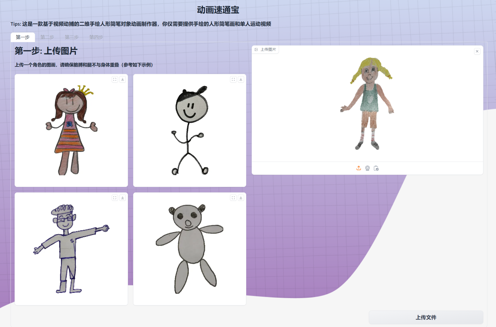

# Simplified Animated Drawings

This is the simplified version
of [facebookresearch/AnimatedDrawings: Code to accompany "A Method for Animating Children's Drawings of the Human Figure" (github.com)](https://github.com/facebookresearch/AnimatedDrawings)
. here we can **custom your monocular video and drawing as input**, framework will automatically generate corresponding
animation. All processes are in **end-to-end way**.

**If you want to see more details in initial README.md, [clik here.](OFFICIAL_README.md)**

Here are some generated 2D animation:

|  demo1             |         demo2        |      demo3     |  
| -------------------| -------------------- |----------------|
|      |                   |   |  

**Tips:**
We also provide an interactive frontend-backend separation system. For more details, please see [fronted-branch](https://github.com/Brian417-cup/AnimatedDrawings/tree/client_pr) and [backend-branch](https://github.com/Brian417-cup/AnimatedDrawings/tree/server_pr).

|  Step1             |         Step2        |      Step3     |        Step4     |  
| -------------------| -------------------- |----------------|----------------|
|      |                   |   |    |

## Installation

*This project has been tested with Windows 11. If you're installing on another operating
system, you may encounter issues.*

We *strongly* recommend activating a Python virtual environment prior to installing Animated Drawings. Conda's Miniconda
is a great choice. Follow [these steps](https://conda.io/projects/conda/en/stable/user-guide/install/index.html) to
download and install it. Then run the following commands:

````bash
    # create and activate the virtual environment
    conda create --name animated_drawings python=3.8.13
    conda activate animated_drawings

    # clone AnimatedDrawings and use pip to install
    git clone https://github.com/Brian417-cup/AnimatedDrawings
    cd AnimatedDrawings
    pip install -e .
````

### Crate Animation from Monocular Video

Now, to simplify process, all you need to do is provide a drawing and a single person video to generate an animation in
the offline mode and virutal conda environment locally!!

Here are tips:

1. Download the corresponding resource file from
   the [provided link](https://drive.google.com/drive/folders/17rBGjufhzAhM_qNjnsenBFTngk_YgXYR?usp=drive_link), and
   then put them under corresponding directories respectively:

| resource name              |                     target directory                |
| -------------------------- | ---------------------------------------------------- |
| sketch_detector.onnx       | [examples/offline_res/checkpoint](examples/offline_res/checkpoint)  |
| sketch_estimator.onnx      | [examples/offline_res/checkpoint](examples/offline_res/checkpoint)  |
| yolov8                     | [examples/offline_lib/pose3d/vitpose/checkpoints](examples/offline_lib/pose3d/vitpose/checkpoints) |
| vitpose-b-coco.onnx        | [examples/offline_lib/pose3d/vitpose/checkpoints](examples/offline_lib/pose3d/vitpose/checkpoints) |
| pose3d.onnx                | [examples/offline_lib/pose3d/checkpoint](examples/offline_lib/pose3d/checkpoint) |

2. Use the following command:

```shell
cd examples
python offline_demo.py \
--src_sketch <your_custom_drawing_path> \
--src_motion <your_source_video_path_or_bvh_file_path> \
--out_vid <output_video_path>
```

**Attention: Currently, the projection way proposed in the thesis is static, if you want to get more interesting
projection way, please modify [certain retarget config file](examples/offline_lib/retarget/h36m_retarget_base.yaml).**

The final result may get this:


3. If you want to see 