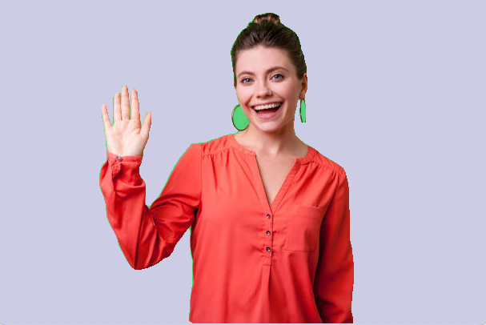
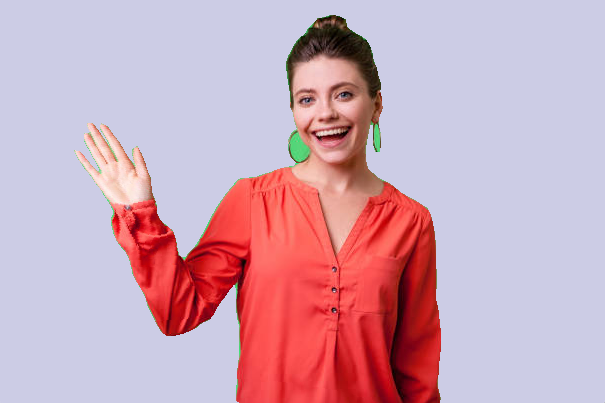

## Standalone example of As-Rigid-As-Possible 

### Theory and implementation details:

Implementing As-Rigid-As-Possible Shape Manipulation and Surface Flattening 

http://citeseerx.ist.psu.edu/viewdoc/download?doi=10.1.1.173.3112&rep=rep1&type=pdf

### To run:

    python main.py ${PATH_TO_IMAGE} ${PATH_TO_MASK} ${PATH_TO_ARAP_HANDLES}
    
Note: The image should be a PNG of type RGB. 
The mask should be binary, have the same dimensions as the image, and have exactly one foreground contour within it. 
ARAP handles should be specified in a csv containing a row for each handle, where the first value
indicates the x offset from the left side of the image, and the second value indicates the y offset from the top of the image.

See ./input/ for an example.

### Controls

While running, press spacebar to show/hide the black mesh lines. 
Use WASD to move the *first* handle specified in the ARAP handle csv.
Press Escape to quit

### Trouble Shooting

If you get this message when using macOS Big Sur : 

    ImportError: ('Unable to load OpenGL library', 'dlopen(OpenGL, 10): image not found', 'OpenGL', None)
    
It's because Big Sur moved the location of OpenGL. Try the solutions proposed here:

https://stackoverflow.com/questions/63475461/unable-to-import-opengl-gl-in-python-on-macos
